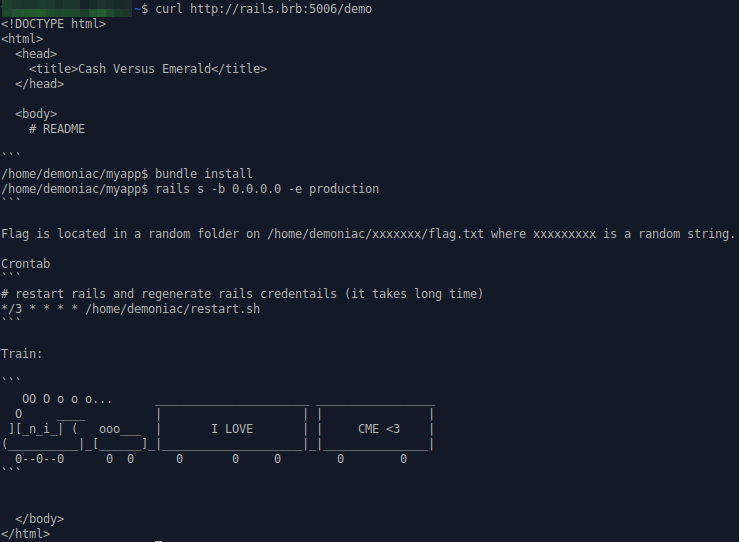
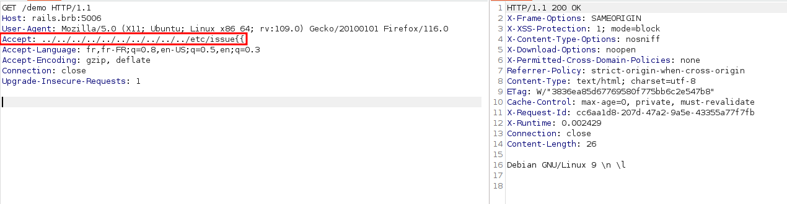
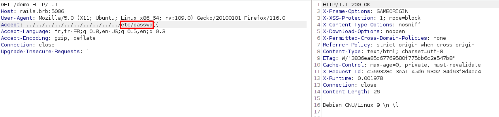
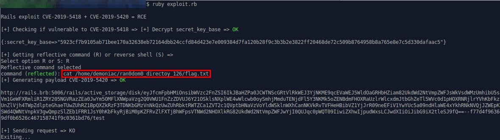

# Tchou-tchou

Ceci est le writeup du challenge tchou-tchou proposé au ctf de la Barbhack 2023. Il a été créé par mpgn à qui on doit le crackmapexec d'aujourd'hui.

## Compréhension du challenge
Le challenge est composé d'une unique page Web :

**Le but du challenge est de lire le flag.txt qui est présent dans un dossier inconnu de */home/demoniac*.**

Sur la page du chall, on peut remarqué la commande *rails s -b 0.0.0.0 -e production*.

Un peu de recherche nous permet de comprendre qu'une application web rails/ruby est lancé sur l'interface locale en mode "production". Ce mode active le cache des pages, ce qui rend le chargement plus rapide. On note aussi qu'il est redémarré toutes les trois minutes via une cron job.

## Les vulnérabilités à exploiter
J'ai cherché "rails server production exploit" sur google et je suis tombé sur le [PoC](https://github.com/mpgn/Rails-doubletap-RCE) github "Rails doubletap exploit" écrit par le créateur du chall.

Cet exploit est un chainage de deux CVE sur un rails server qui permet d'y exécuter une commande à distance.La première CVE (CVE-2019-5418) permet de lire les fichiers du serveur via une injection en path traversal sur le header "Accept". En l'utilisant, on peut récupérer deux fichiers: *credentials.yml.enc* et *master.key*, qui vont nous permettre de récupérer la "SECRET KEY BASE" en déchiffrant *credentials.yml.enc* avec *master.key*. La "SECRET KEY BASE" nous permettra de lancer la 2e CVE (CVE-2019-5420) qui utilise en gros la deserialization d'objets Ruby (j'ai pas lu les détails, je reviens vers vous quand c'est fait hein) pour exécuter une commande sur le serveur.

Evidemment, ça c'est quand le scénario est idéal et que le serveur est en mode développement (càd avec le cache des pages désactivé). Ici, le créateur a pris un malin plaisir à le mettre en mode "production".

En pratique du coup, lorsqu'on exploite la première CVE pour tester le serveur, on obtient bien le fichier demandé :

Mais à cause de la mise en cache, il nous renvoit toujours le même lorsqu'on met autre chemin.

Cependant, comme le serveur est redémarré au bout de quelques minutes, le cache est vidé donc on peut relancer la CVE.

## Exploitation
Si on reprend le PoC de mpgn, on observe qu'il va faire une requête HTTP pour chercher credentials.yml.enc et une autre pour master.key. 

Ensuite, il exploite la vulnérabilité de desérialisation et exécute la commande de notre choix. L'output est redirigé vers un fichier du serveur, qu'il faut récupérer.

On comprend donc qu'on va être bloqué pour récupérér les deux premiers fichiers étant donné que ceux-ci changent à chaque redémarrage et que le cache nous empêche de lire 2 fichiers à la suite.

Quelques recherches sur "rails doubletap exploit" nous permettent de tomber sur le tips suivant (j'ai remarqué après que mpgn renseigne le tips directement dans le PoC):

Une race condition est possible et on peut obtenir deux fichiers à la fois via curl. On récupère donc les deux fichiers :

Et une fois les 2 fichiers obtenus, j'ai modifié le PoC pour qu'il les utilise et déchiffre la "SECRET KEY BASE". 

Avec le résultat, il crée la payload utilisée pour exploiter la CVE-2019-5420 avec la commande de notre choix.

J'ai lancé la commande : *ls /home/demoniac/* pour identifier le dossier et une fois la commande exécutée, j'ai attendu que le serveur redémarre pour contourner la mise en cache. Puis j'ai relancé la CVE-2019-5418 pour récupérer le fichier d'output de la commande (*/tmp/results*) :

Le dossier identifié, on refait toute la procédure (avec la race condition) pour pouvoir faire un *cat flag.txt*.

### Note sur le setup
 J'ai perdu beaucoup de temps sur l'installation de Ruby dû à des problèmes d'incompatibilité avec la versions que j'avais et celle utilisée par le PoC (j'aurais pu être first blood sur ce chall). Si vous voulez réutiliser le PoC, je vous conseille donc de désinstaller votre version Ruby et de réinstaller la version via *rbenv install 2.5.1* puis finir avec *bundle install --gemfile=demo-5.2.1/Gemfile*.
