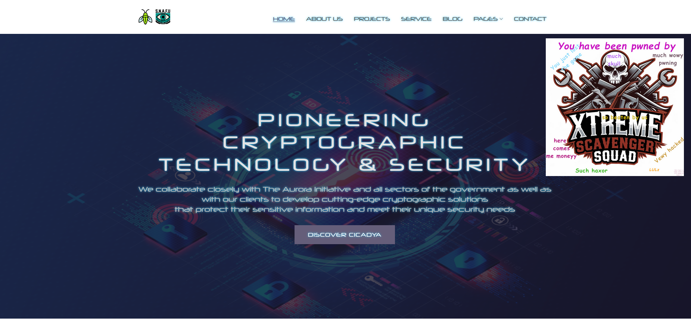
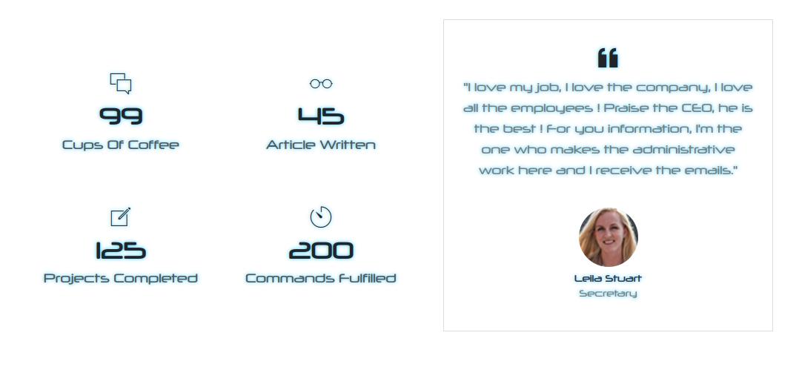
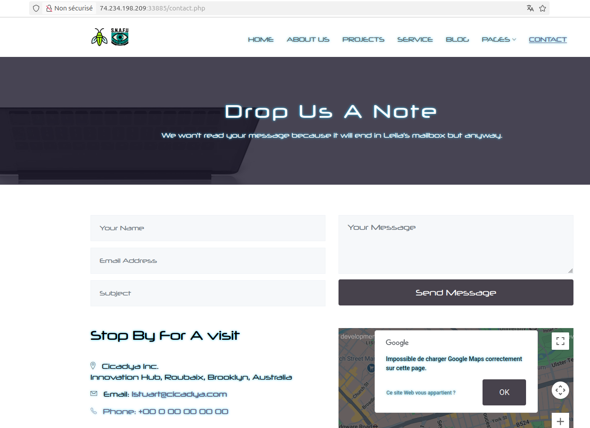
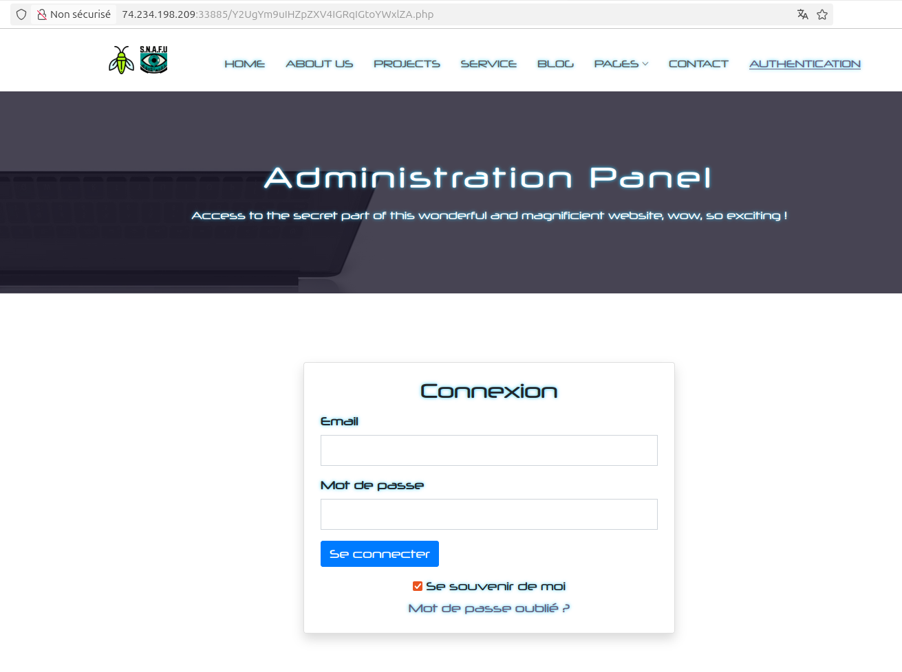
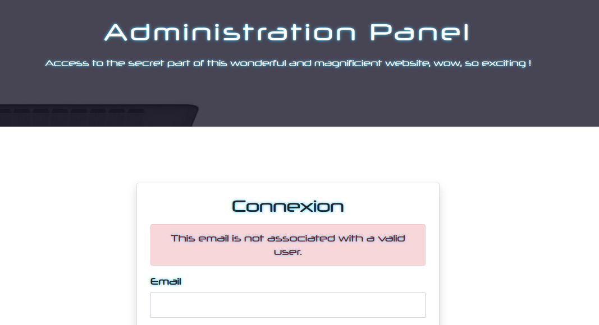
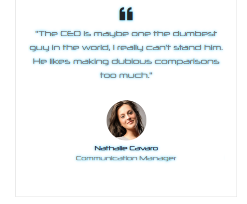
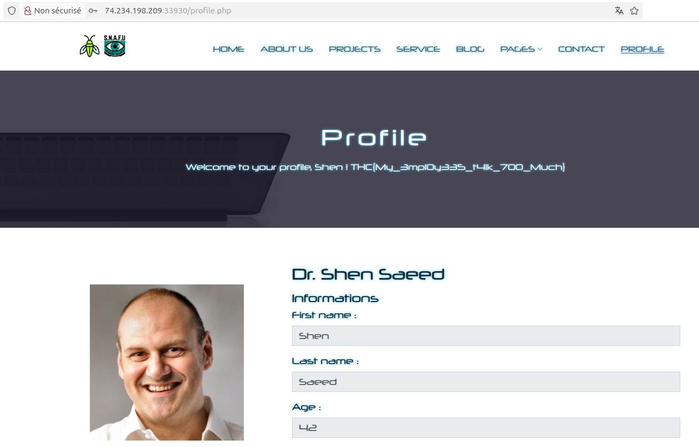
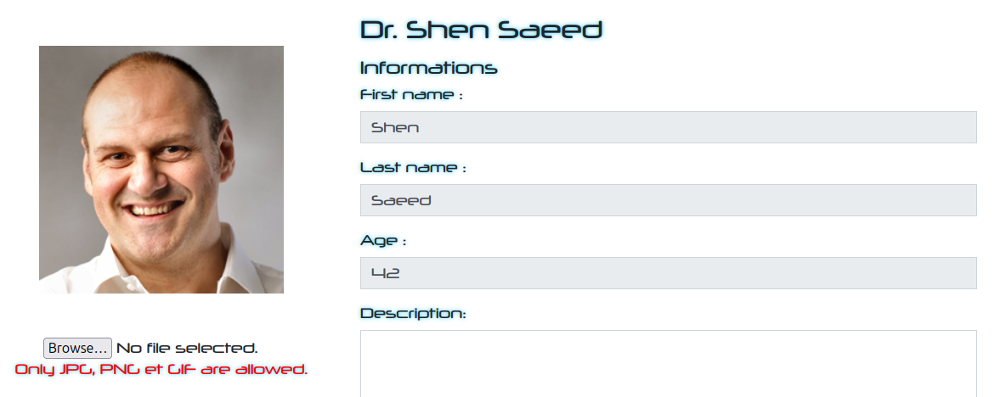
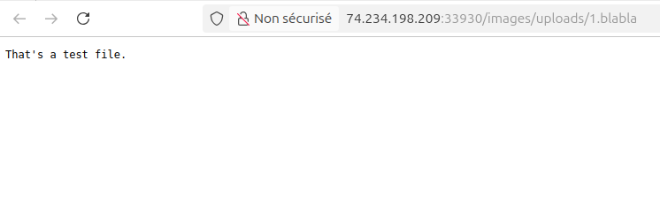
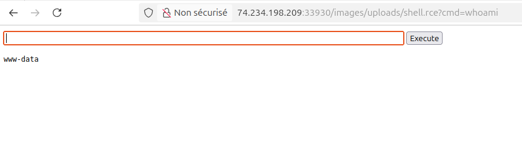

# Cicadya - Write-up
## Introduction
Here's the writeup of both challenges "Cicadya - Whos the boss?" and "Cicadya - Nice pic bro" that I created for the THCON 2025.\
I'll try to explain how to solve the challenge from the point of view of someone discovering it for the first time (with the creator's knowledge of course). Because I'm tired of challenge creators who go straight to the answer without explaining and detailing the process that led to solving the challenge.
## Actual write-up

<p align="center"></p>

The website is a legit company's website so all the pages will be filled with bullshit company's information and description (generated by myself and chatGPT).\
Starting on the first page, on the bottom, we can find employee's quotes. We directly gather their names as it is always useful and keep the quotes in mind.<br><br>

<p align="center"></p>

We can notice `faq.php` and `contact.php` has the email of "Leila Stuart", an employee we found on the first page.<br><br>

<p align="center"></p>

We identify a specific email pattern : `<FIRST_LETTER_OF_FIRST_NAME><LAST_NAME>@cicadya.com`.\
With that in mind, we can generate a wordlist of email addresses with the name of employees we gathered.\
If we review the source code of `index.php`, we notice a link commented in the nav bar that leads to an authentication page.<br><br>

<p align="center"></p>
<p align="center"></p>

On this page, enumeration is possible on the email field as the page specifies if the mail is associated with an user.

<p align="center"></p>

We can "bruteforce" the email field with our email adresses wordlist and find that `ssaeed@cicadya.com` and `jjhonson@cicadya.com` are valid emails.\
At this step, you will realize that employees' quotes give us all the information we need to bypass the authentication.\
Indeed, we can guess with this quote that only Dr. SAEED has access to the administration panel, `jjhonson@cicadya.com` is unfortunately a rabbit hole.

<p align="center"></p>

With the following quotes and the previous one, it is understandable that we have a SHA256 loose comparison (type juggling) on authentication and that we need to use a sha256 magic hash to bypass it (search "SHA256 comparison magic" on Google).<br><br>
 <br><br>
For those who don't know this vulnerability, if PHP uses `==` instead of `===` to compare elements, it can lead to surprising results as PHP try to convert elements in the same type.
For example, a string that begins with `0e99999` will be treated as 0 in scientific notation and comparing two strings that begins with `0e` will return `True`. Magic hashes for MD5, SHA1, SHA256, etc are specific strings whose hashes begin with `0e`.<br><br>
In this authentication, Dr. SAEED password hash begin with `0e` and it is compared to the hash of the user supplied password to verify his identity. So by supplying any SHA256 magic hashes on the password and `ssaeed@cicadya.com` as the email you can bypass authentication and access the profile page, a list can be found [here](https://github.com/spaze/hashes/blob/master/sha256.md).
We get the first flag on the profile page.

<p align="center"></p>

Spoiler, the "Description" field is a rabbit hole, you can't do anything with it.\
The profile pic is actually our way. But it blocks every executable extension (I make sure of that) and seems to only allow pictures extensions.

<p align="center"></p>

However, if you try uploading a file with an unconventional extension (`.blabla` for example) it works and is displayed in raw text :

<p align="center"></p>

On real-world Apache websites with file upload functionality, it's common to be able to override the upload directory configuration by uploading an htaccess that will allow files with the chosen extension to be interpreted as PHP files.\
These technique can be found [here](https://github.com/swisskyrepo/PayloadsAllTheThings/tree/master/Upload%20Insecure%20Files/Configuration%20Apache%20.htaccess).\
We can follow the tutorial and upload an htaccess file containing :
```
AddType application/x-httpd-php .rce
```
Then, we upload [this webshell](https://gist.githubusercontent.com/joswr1ght/22f40787de19d80d110b37fb79ac3985/raw/c871f130a12e97090a08d0ab855c1b7a93ef1150/easy-simple-php-webshell.php) with the extension we previously allowed.
We navigate to our file and gain RCE :

<p align="center"></p>

**The flag is in the `/` directory.**
